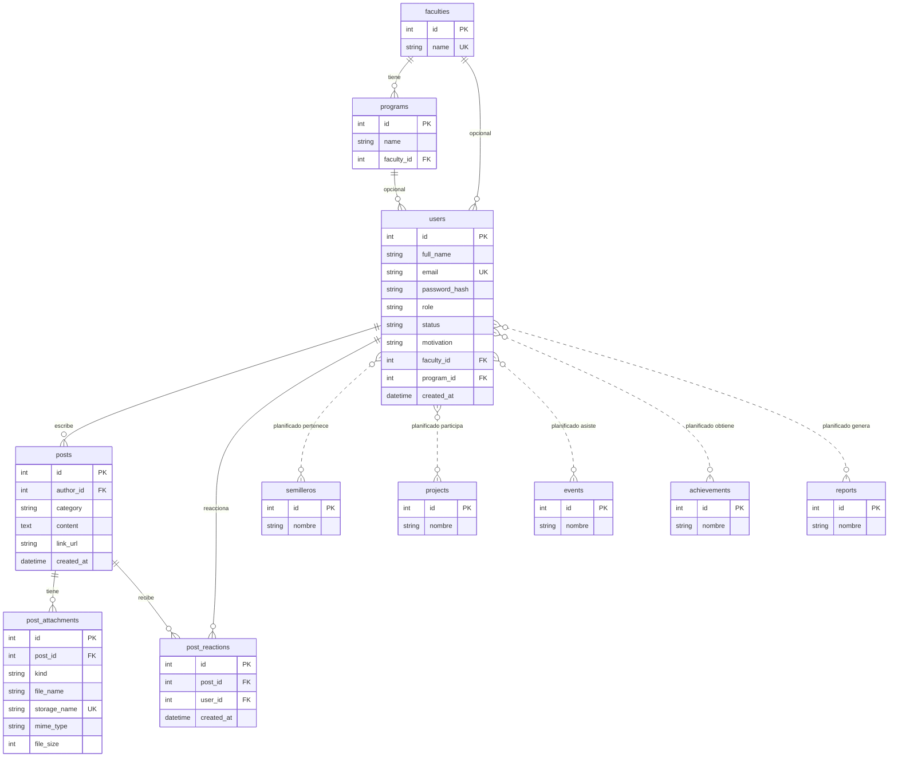

# RIUL — esquema entidad-relación por dominio

Fuente de verdad de las tablas **implementadas**: [`backend/migrations/versions/0001_initial_mysql_tables.py`](../backend/migrations/versions/0001_initial_mysql_tables.py). Motor: MySQL 8.4.

Las entidades **planificadas** salen de `unavailable` en el overview de admin (`semilleros`, `projects`, `events`, `achievements`, `reports`). No existen en MySQL: solo `id` + `nombre`, sin FKs reales.

Diagrama principal en Draw.io: [`docs/er-riul.drawio`](er-riul.drawio). Abrir en [app.diagrams.net](https://app.diagrams.net/) o en VS Code / Cursor con la extensión Draw.io. Cada dominio es un recuadro **transparente** con título (`Dominio 1 — Identidad y acceso (auth)`, etc.); el color de dominio va en el encabezado de cada tabla.

Copia Lucidchart (se parte al agrupar): [editar](https://lucid.app/lucidchart/7cb95ea3-6ab7-4ddb-8d58-2dca05520ea0/edit) · [ver](https://lucid.app/lucidchart/7cb95ea3-6ab7-4ddb-8d58-2dca05520ea0/view).

Este archivo también sirve para dbdiagram.io (pegar DBML más abajo).

## Leyenda de color

Relaciones **cruzadas** (autor, reacciones, FKs académicas) se dibujan en gris `#94A3B8`; no usan el color del dominio destino. Recuadros punteados = dominio aún no migrado a MySQL.

| Dominio | Color | Estado | Tablas |
| --- | --- | --- | --- |
| 1 Identidad y acceso (auth) | carmesí RIUL `#7B001F` | implementado | `users` |
| 2 Catálogo académico | azul `#2563EB` | implementado | `faculties`, `programs` |
| 3 Feed / publicaciones | verde azulado `#0F766E` | implementado | `posts`, `post_attachments`, `post_reactions` |
| 4 Semilleros | morado `#7C3AED` | planificado | `semilleros` (stub) |
| 5 Proyectos | verde `#15803D` | planificado | `projects` (stub) |
| 6 Eventos | ámbar `#D97706` | planificado | `events` (stub) |
| 7 Gamificación | naranja `#EA580C` | planificado | `achievements` (stub) |
| 8 Reportes | gris `#64748B` | planificado | `reports` (stub) |

## Diagrama Mermaid

El `.drawio` ya trae color de tabla + ventana de dominio. Stubs: borde y recuadro punteados. Enlaces `users` → stubs: línea punteada gris (aún no hay FK).



## Restricciones y enumeraciones (implementado)

Copiado de la migración y de los modelos SQLAlchemy.

### Claves foráneas

| Tabla | Columna | Referencia |
| --- | --- | --- |
| `programs` | `faculty_id` NOT NULL | `faculties.id` |
| `users` | `faculty_id` NULL | `faculties.id` |
| `users` | `program_id` NULL | `programs.id` |
| `posts` | `author_id` NOT NULL | `users.id` |
| `post_attachments` | `post_id` NOT NULL | `posts.id` |
| `post_reactions` | `post_id` NOT NULL | `posts.id` |
| `post_reactions` | `user_id` NOT NULL | `users.id` |

### Uniques e índices

| Tabla | Restricción |
| --- | --- |
| `faculties` | UNIQUE `name` |
| `programs` | UNIQUE `(name, faculty_id)` |
| `users` | UNIQUE INDEX `ix_users_email` (`email`) |
| `post_attachments` | UNIQUE `storage_name` |
| `post_reactions` | UNIQUE `(post_id, user_id)` |

### Valores de aplicación (no CHECK en MySQL aún)

| Columna | Valores |
| --- | --- |
| `users.role` | `researcher` \| `leader` \| `administrator` (default `researcher`) |
| `users.status` | `active` \| `pending` \| `rejected` (default `active`) |
| `posts.category` | `article` \| `project_advance` \| `presentation` \| `event` \| `community` (default `community`) |
| `post_attachments.kind` | `image` \| `file` |

`created_at` en `users`, `posts` y `post_reactions`: `DATETIME` con `DEFAULT CURRENT_TIMESTAMP`.

## DBML

Importable en [dbdiagram.io](https://dbdiagram.io). Los `Note` marcan color y estado. Stubs sin `Ref` hacia `users`.

```dbml
Project riul {
  database_type: 'MySQL'
  Note: 'Implementado = migración 0001. Stubs = overview admin unavailable.'
}

TableGroup catalogo_academico [color: #2563EB] {
  faculties
  programs
}

TableGroup identidad_acceso [color: #7B001F] {
  users
}

TableGroup feed_publicaciones [color: #0F766E] {
  posts
  post_attachments
  post_reactions
}

TableGroup semilleros_planificado [color: #7C3AED] {
  semilleros
}

TableGroup proyectos_planificado [color: #15803D] {
  projects
}

TableGroup eventos_planificado [color: #D97706] {
  events
}

TableGroup gamificacion_planificado [color: #EA580C] {
  achievements
}

TableGroup reportes_planificado [color: #64748B] {
  reports
}

Table faculties {
  id int [pk, increment]
  name varchar(120) [unique, not null]

  Note: 'Dominio catálogo #2563EB — implementado'
}

Table programs {
  id int [pk, increment]
  name varchar(120) [not null]
  faculty_id int [not null]

  indexes {
    (name, faculty_id) [unique]
  }

  Note: 'Dominio catálogo #2563EB — implementado'
}

Table users {
  id int [pk, increment]
  full_name varchar(160)
  email varchar(255) [unique, not null]
  password_hash varchar(255) [not null]
  role varchar(20) [not null, default: 'researcher', note: 'researcher | leader | administrator']
  status varchar(20) [not null, default: 'active', note: 'active | pending | rejected']
  motivation varchar(500)
  faculty_id int
  program_id int
  created_at datetime [not null, default: `CURRENT_TIMESTAMP`]

  Note: 'Dominio identidad #7B001F — implementado'
}

Table posts {
  id int [pk, increment]
  author_id int [not null]
  category varchar(30) [not null, default: 'community', note: 'article | project_advance | presentation | event | community']
  content text
  link_url varchar(500)
  created_at datetime [not null, default: `CURRENT_TIMESTAMP`]

  Note: 'Dominio feed #0F766E — implementado'
}

Table post_attachments {
  id int [pk, increment]
  post_id int [not null]
  kind varchar(10) [not null, note: 'image | file']
  file_name varchar(255) [not null]
  storage_name varchar(120) [unique, not null]
  mime_type varchar(100)
  file_size int

  Note: 'Dominio feed #0F766E — implementado'
}

Table post_reactions {
  id int [pk, increment]
  post_id int [not null]
  user_id int [not null]
  created_at datetime [not null, default: `CURRENT_TIMESTAMP`]

  indexes {
    (post_id, user_id) [unique]
  }

  Note: 'Dominio feed #0F766E — implementado'
}

Table semilleros {
  id int [pk]
  nombre varchar [note: 'stub']

  Note: 'Planificado #7C3AED — no hay tabla en MySQL'
}

Table projects {
  id int [pk]
  nombre varchar [note: 'stub']

  Note: 'Planificado #15803D — no hay tabla en MySQL'
}

Table events {
  id int [pk]
  nombre varchar [note: 'stub']

  Note: 'Planificado #D97706 — no hay tabla en MySQL'
}

Table achievements {
  id int [pk]
  nombre varchar [note: 'stub']

  Note: 'Planificado #EA580C — no hay tabla en MySQL'
}

Table reports {
  id int [pk]
  nombre varchar [note: 'stub']

  Note: 'Planificado #64748B — no hay tabla en MySQL'
}

Ref: programs.faculty_id > faculties.id
Ref: users.faculty_id > faculties.id
Ref: users.program_id > programs.id
Ref: posts.author_id > users.id
Ref: post_attachments.post_id > posts.id
Ref: post_reactions.post_id > posts.id
Ref: post_reactions.user_id > users.id
```

## Cómo usarlo después

1. **Draw.io**: Arrange → Insert → Advanced → Mermaid, pegar el bloque `erDiagram`. Colorear grupos a mano con los hex.
2. **dbdiagram.io**: New diagram → pegar el DBML. Los `TableGroup` ya llevan color.
3. **Lucidchart**: el documento ya existe (enlace al inicio de este archivo). Stubs van con borde punteado; FKs reales en gris `#94A3B8`.
